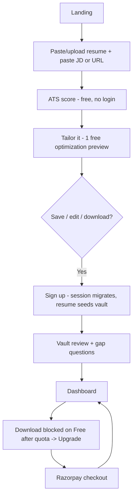
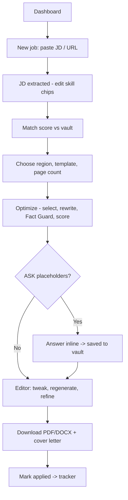
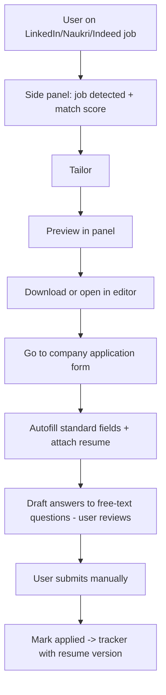
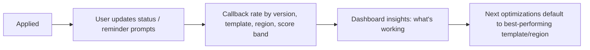

# PRD — Resume Optimizer v1 (working name: **Tailor**)

| | |
|---|---|
| Owner | Melchizedek Technologies Pvt Ltd (MTPL) |
| Client brief | Clone of hireraft.io with value-adding features and improved flows |
| Status | Draft v1 — awaiting sign-off |
| Date | 2026-10-09 |
| Companion docs | `TRD.md` (technical design), `CLAUDE.md` (build instructions) |

> Product name, brand colors and domain are placeholders. All are config/env driven.

---

## 1. Summary

A web app + Chrome extension that tailors a job seeker's resume to each job description. The user builds a **Career Vault** once (all roles, achievements, metrics, skills — confirmed by them). For every job, the system selects the most relevant vault items, rewrites them in the job's language and the target country's resume format, scores ATS fit before/after, and exports a clean PDF/DOCX. The extension brings this onto job boards and autofills application forms. A tracker records applications and shows which resume versions get callbacks.

**Positioning vs HireRaft:** HireRaft rewrites whatever resume you paste, every time. Tailor builds from a growing, verified career record, never invents facts, works inside job boards, and learns from outcomes.

---

## 2. Goals & non-goals

### Goals (v1)
1. Time to first ATS score < 60 seconds from landing, **without signup**.
2. Tailored resume generated in ≤ 30 s (p50), with zero unverified facts reaching export.
3. Profitable at India price points (₹199–₹399/month) with AI cost under 15% of revenue.
4. Retention driver: vault + extension + tracker make the product the user's daily job-search tool.

### Non-goals (v1)
- Gmail/inbox sync (needs Google restricted-scope security audit — v2).
- Interview prep / mock interviews (v2).
- Placement cell / team wallet (v2).
- Recruiter-side marketplace.
- Auto-submitting applications on the user's behalf (never — the user always submits).
- Native mobile apps (responsive web only).

---

## 3. Users

| Persona | Need | What wins them |
|---|---|---|
| Fresher / student (India) | No experience, doesn't know what counts | Gap questions surface projects, internships, coursework as real achievements |
| IT professional | Stack keywords must survive ATS | Keyword coverage, alias handling (JS = JavaScript), quick tailoring per JD |
| Mid/senior / manager | Scope, headcount, P&L must read senior | Quantified, seniority-calibrated bullets from vault metrics |
| Career switcher | Reframe old experience | Vault items rewritten in target-domain language, premium rewrite tier |
| Cross-border applicant (IN → US/UK/CA/EU) | Wrong format gets filtered | Region formats: length, photo/DOB rules, spelling, CV vs resume |

---

## 4. v1 scope

| # | Feature | In v1 |
|---|---|---|
| F1 | Anonymous try-first flow (ATS check + 1 optimization without login) | ✅ |
| F2 | Auth & onboarding | ✅ |
| F3 | Career Vault (build from upload, gap questions, editor) | ✅ |
| F4 | Job intake (paste JD, URL fetch, extension capture) | ✅ |
| F5 | ATS score & keyword analysis (deterministic) | ✅ |
| F6 | Optimizer (vault → tailored resume) with Fact Guard | ✅ |
| F7 | Resume editor (all paid tiers) + section regenerate + refine | ✅ |
| F8 | Region formats (IN / US / UK / EU) + templates + PDF/DOCX export | ✅ |
| F9 | Cover letter | ✅ |
| F10 | Application tracker + callback insights (manual status) | ✅ |
| F11 | Chrome extension (capture, match score, tailor, autofill) | ✅ |
| F12 | Plans, credits, Razorpay billing | ✅ |
| F13 | Admin panel (users, plans, AI usage & cost, flags) | ✅ |
| F14 | Skill roadmap | ❌ dropped (low value) — keyword gaps link to "how to add this" guidance only |

---

## 5. Feature specifications

### F1 — Anonymous try-first flow
**Why:** HireRaft forces login before any value. We show value first.

**Requirements**
- Landing page hero has two inputs: resume (upload PDF/DOCX or paste) and job (paste JD or URL).
- Click **Check my ATS score** → score, matched/missing keywords, section checks. No account.
- Then **Tailor it** → one free optimization rendered as a read-only preview.
- Save, edit, download, or a second optimization → signup modal. On signup, the anonymous session (resume, job, result) migrates to the new account; the uploaded resume seeds the vault.
- Abuse limits: Cloudflare Turnstile before AI calls; max 2 anonymous optimizations per IP per 24 h and 1 per browser fingerprint; anonymous data auto-deleted after 72 h.

**Acceptance**
- From landing to ATS score in under 60 s for a 2-page resume.
- Signup preserves the exact result the user saw; no re-processing.

### F2 — Auth & onboarding
- Email + OTP and Google sign-in. No passwords in v1.
- Onboarding (≤ 3 screens): target country/region, target role(s), experience level. Skippable.
- Consent screen: data use, AI processing disclosure, model-improvement opt-in (default **off**), DPDP-compliant.

### F3 — Career Vault
**Purpose:** a structured, user-confirmed record of the user's career. Every tailored resume is built from it. Every claim in output must trace back to a vault item.

**Contents**
- Profile: name, contact, location, links (LinkedIn, GitHub, portfolio), work authorization (optional), headline.
- Roles: company, title, location, start/end, employment type, team size, scope summary.
- Achievements (child of role or project): text, metrics (value + unit + context), tools/skills tags, impact type (revenue, cost, time, quality, scale, leadership), variants (technical / leadership / business phrasing — optional).
- Projects, Education, Certifications, Skills (name, category, proficiency, years), Languages, Awards, Publications, Volunteering.

**Build flow**
1. Upload resume (PDF/DOCX) or paste text, or import from anonymous session.
2. AI parses into vault structure (one call, premium model). User sees a review screen grouped by role; low-confidence fields highlighted.
3. **Gap questions:** up to 8 targeted questions where impact is vague ("How many dashboards? Who used them? Any time saved?"). Answers become metrics on achievements. Skippable; can be revisited from the vault page ("Strengthen your vault" — shows a vault strength %).
4. User confirms → vault saved. Items are marked `confirmed`.

**Ongoing**
- Vault editor: add/edit/delete/reorder any item, tag skills, mark items hidden.
- Edits made in the resume editor prompt **"Save this to your vault?"** (updates the source achievement or creates a variant).
- Multiple uploads merge with de-duplication suggestions (same company + overlapping dates).

**Acceptance**
- 90% of fields from a standard single-column resume land in the right vault fields without manual fixing.
- Vault strength score shown and increases as metrics are added.

### F4 — Job intake
- Inputs: paste JD text, paste URL (server fetches & extracts readable text), or extension capture.
- AI extracts: title, company, location, seniority, employment type, must-have skills, nice-to-have skills, responsibilities, keywords (with aliases), years required, education requirements, region guess.
- JD extraction is **cached by normalized URL and by content hash**, shared across users.
- User can edit extracted must-have/nice-to-have lists before optimizing (chips UI).
- Jobs are saved to the tracker automatically with status `Saved`.

### F5 — ATS score & keyword analysis
- **Deterministic** (no AI call). Formula in TRD §6.1.
- Output: overall score 0–100, sub-scores (keyword coverage, must-haves, title alignment, quantified bullets, format/parse safety, section completeness), matched / missing / partially matched keywords, per-section notes.
- Shown before and after optimization with delta.
- **Honesty note in UI:** "This score estimates keyword and format fit. Real ATS systems vary." No fake "92% guaranteed" claims.

### F6 — Optimizer with Fact Guard
**Inputs:** vault, job extraction, region format, template, page target (1 or 2), tone (default / more technical / more leadership).

**Process**
1. **Select** (code, no AI): rank vault items by relevance to the JD (TRD §6.2); pick the set that fits the page budget.
2. **Rewrite** (AI): summary + selected achievements rewritten using JD language, region conventions, strong verbs, metrics from the vault only. Skills section ordered by JD priority.
3. **Fact Guard** (code): every number, percentage, currency amount, company, title, date, degree and certification in output must exist in the selected vault items. Violations → the bullet is reverted to the closest vault phrasing and flagged. Missing info the model needed appears as `[[ASK: question]]` placeholders.
4. **Score** after (F5) and show the diff.

**Output screen**
- Left: resume preview (template rendered). Right: score before → after, keyword checklist, flagged items, `[[ASK]]` prompts with inline answer boxes (answers saved to the vault and re-applied without a new AI call where possible).
- Toggle **Show changes** — highlights rewritten bullets vs vault source.
- Download is blocked while unresolved `[[ASK]]` placeholders exist (user can resolve or delete them).

**Model routing**
- Default tier: standard model. **Premium rewrite** (button, uses premium credits): premium model — recommended automatically for career switchers (vault domain ≠ JD domain) and senior roles.

**Acceptance**
- p50 ≤ 30 s end-to-end, p95 ≤ 60 s.
- Zero exported resumes contain a number or employer not present in the vault (enforced by Fact Guard; covered by tests).
- Keyword coverage of must-haves improves on ≥ 90% of runs where the vault contains the skill.

### F7 — Resume editor
- Available on **all paid tiers** (HireRaft locks it to its top tier — a key fix).
- Inline WYSIWYG editing on the rendered resume: text, reorder bullets/sections, hide/show items, swap in other vault items ("Add from vault" drawer).
- Live keyword checklist: warns when an edit drops a must-have keyword.
- **Section regenerate** (AI): regenerate one section; max 3 per optimization included, then counts against credits.
- **Refine** (AI): short instruction box ("make it more leadership-focused", "shorter bullets"); max 3 per optimization included.
- Version history per optimization; reset to AI original; every save is a `ResumeVersion`.
- One-page / two-page fit: auto-fit by spacing/typography down to a minimum readable size (body ≥ 10 pt); if still overflowing, prompt the user to drop lowest-ranked items (no AI).

### F8 — Region formats, templates, export
**Region presets** (config, not AI):

| | India | US | UK | EU |
|---|---|---|---|---|
| Document label | Resume | Resume | CV | CV |
| Length default | 1–2 pages | 1 page (2 if 10+ yrs) | 2 pages | 2 pages |
| Photo | Optional (off by default) | Never | Never | Optional |
| DOB / marital status / gender | Optional fields, off by default | Never | Never | Never (Europass optional field set) |
| Spelling | en-IN (British base) | en-US | en-GB | en-GB |
| Date format | MMM YYYY | MMM YYYY | MMM YYYY | MM/YYYY |
| Personal statement | Summary | Summary | Profile | Profile |
| Extras | Notice period (optional), CTC hidden | Work authorization line (optional) | Right to work (optional) | Languages with CEFR level |

- Rewrite prompt receives the region rules (spelling, verb style, section naming).
- Templates: 4 ATS-safe single-column templates in v1 (Classic, Modern, Compact, Executive). No tables, no text in images, no multi-column body, standard section headings.
- Export: PDF (selectable text, embedded fonts) and DOCX. File name: `Firstname_Lastname_Role_Company.pdf`.

### F9 — Cover letter
- Generated from the optimization context (selected vault items + JD + company). 250–350 words, region-aware.
- Tone: professional / warm / direct. Editable inline. One cover letter included per optimization; regenerations count as refines.
- Export PDF/DOCX matching the resume template.

### F10 — Application tracker & callback insights
- Kanban + table views. Statuses: `Saved → Applied → Screening → Interview → Offer`, plus `Rejected`, `Withdrawn`, `Ghosted` (auto-suggested after 21 days in Applied with no update).
- Each application links to the job, the exact resume version and cover letter used, source (manual / extension), applied date, notes, contact, follow-up date with reminder email.
- **Insights (code, no AI):** callback rate (Screening or later ÷ Applied) overall and by resume version, template, region, ATS score band, job source, seniority. Insights unlock once ≥ 10 applications exist; each comparison needs ≥ 5 per bucket, else marked "not enough data yet".
- Weekly summary email (opt-in): applications sent, callbacks, follow-ups due.

### F11 — Chrome extension
**Supported job boards v1:** LinkedIn Jobs, Naukri, Indeed (+ generic readability fallback on any page).
**Supported application forms v1 (autofill):** Greenhouse, Lever, Workday (+ generic heuristic on other forms).

**Capabilities**
1. **Capture:** on a job page, the side panel shows the detected job (title, company, location) and a **Match score** using the user's vault (JD extraction is cached; scoring is deterministic).
2. **Tailor:** one click runs the optimizer; result opens in the side panel preview with **Download** and **Open in editor**.
3. **Track:** "Mark as applied" logs the application with the resume version.
4. **Autofill:** on supported forms, fills standard fields (name, email, phone, location, LinkedIn, work history, education) from the vault by rule-based mapping; attaches the tailored resume file; drafts free-text answers (AI) for questions like "Why do you want to work here?" shown for user review. **Never clicks submit.**
5. Auth: user signs in via the web app; extension receives a scoped token.

**Acceptance**
- Detection works on live LinkedIn/Naukri/Indeed pages at release (verified against live DOM, not assumed — see CLAUDE.md).
- Selectors are config-driven and remotely updatable without a store release.

### F12 — Plans, credits, billing
**Unit:** 1 credit = 1 optimization (standard model). Premium rewrites use premium credits.

| Plan | Price | Includes |
|---|---|---|
| Free | ₹0 | 3 optimizations/month, view & ATS check unlimited, 1 PDF download/month, tracker, extension match score |
| Starter | ₹99 one-time | 5 credits, unlimited downloads for 30 days, editor |
| Pro | ₹199/mo · ₹1,990/yr | 40 credits/month, unlimited downloads, editor, cover letters, autofill |
| Power | ₹399/mo · ₹3,990/yr | 150 credits + 20 premium credits/month, everything in Pro, priority queue |

- Included per optimization (no extra credit): 1 cover letter, 3 section regenerates, 3 refines, autofill answers.
- Credits reset monthly; no rollover (except Starter: valid 30 days).
- Razorpay for subscriptions & one-time; GST invoices auto-generated (company GSTIN in config).
- Cancel in 2 clicks; access continues to period end. Plain-language warning before any refund-forfeiting action.
- **All plan limits live in the database** (admin-editable), never hardcoded.

### F13 — Admin panel
- Users: search, view plan/credits, grant credits, suspend.
- Plans: edit prices/limits (Razorpay plan IDs mapped).
- AI usage: calls, tokens, latency, error rate, estimated cost per task/model/day; failure log.
- Extension selector configs: view/edit/publish per job board.
- Flags: Fact Guard violation rate, `[[ASK]]` rate, regenerate rate per model (quality proxies).

---

## 6. Core user flows

### 6.1 First visit → paid user

### 6.2 Returning user — tailor for a job (web)

### 6.3 Extension flow

### 6.4 Outcome loop

---

## 7. Key screens (design reference)

1. Landing (hero with inline try-it inputs, real before/after example, pricing, FAQ)
2. Signup / OTP
3. Onboarding (region, roles, level)
4. Vault review (post-parse) + gap questions
5. Vault editor
6. Dashboard (recent optimizations, applications snapshot, vault strength, credits)
7. New job / JD review
8. Optimization result (preview + score panel + flags)
9. Editor (WYSIWYG + keyword checklist + version history)
10. Cover letter
11. Tracker (kanban + table) + insights
12. Billing / plans
13. Settings (profile, region defaults, data export, delete account)
14. Extension side panel (job detected, match score, tailor, autofill)
15. Admin panel

**Design direction:** minimal, confident, professional. Neutral palette with one accent; Inter (or Geist) typography; 8 px grid; generous whitespace; no decorative illustrations, gradients, or emoji. Data is the visual: score rings, keyword chips, before/after diffs. Dark mode supported. Detailed rules in `CLAUDE.md §Design`.

---

## 8. Success metrics

| Metric | Target (90 days post-launch) |
|---|---|
| Landing → first ATS score | ≥ 35% of visitors who start input |
| Anonymous optimization → signup | ≥ 25% |
| Signup → vault confirmed | ≥ 70% |
| Free → paid conversion | ≥ 4% |
| Paid monthly churn | ≤ 8% |
| Extension install rate (paid users) | ≥ 40% |
| Applications logged per active user / week | ≥ 5 |
| Regenerate rate per optimization (quality proxy) | ≤ 0.8 |
| Fact Guard violation rate before revert | track; ≤ 5% of bullets |
| AI cost as % of revenue | ≤ 15% |

---

## 9. Risks & mitigations

| Risk | Mitigation |
|---|---|
| NVIDIA free endpoint is ~40 RPM, for development only — not licensed for production | Provider-agnostic AI layer; global rate limiter + queue; switch to a paid host (DeepInfra/OpenRouter Nemotron, or Claude Haiku) via env before public launch |
| Nemotron writing quality unproven for resumes | Eval harness (50 blind pairs) built in Phase 0; model per task is config |
| Job board DOM changes break extension | Remote selector configs + generic fallback + admin alerting |
| Resume PII sent to third-party model hosts | Consent disclosure; strip email/phone/address before AI calls (re-inserted in rendering); provider retention review |
| Anonymous flow abuse | Turnstile, IP + fingerprint limits, cached JD extraction |
| AI invents facts | Fact Guard (deterministic) + `[[ASK]]` placeholders |

---

## 10. Open questions (resolve before Phase 2)

1. Final product name, domain, brand color.
2. Company GSTIN and legal entity for invoices.
3. Paid fallback provider for launch (DeepInfra Nemotron vs Claude Haiku 5.5) — decided by eval results.
4. Free plan: allow editor on Free? (zero AI cost; conversion trade-off). Default: no.
