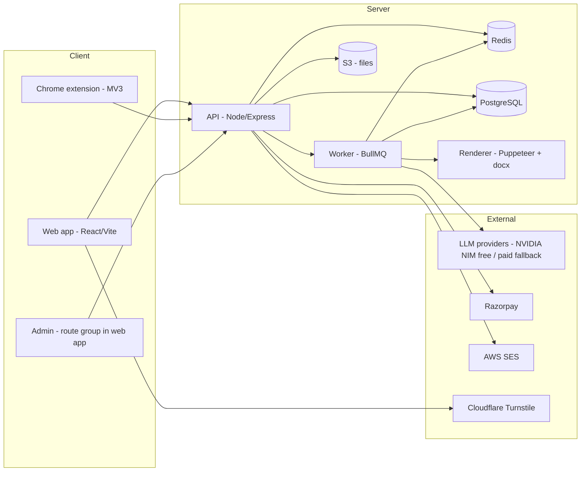

# TRD — Resume Optimizer v1 (Tailor)

Companion to `PRD.md`. This document defines *how* it is built. Where PRD and TRD conflict, PRD wins on behavior, TRD wins on implementation.

---

## 1. Architecture overview



- All AI work runs in the **worker** through a queue (rate-limit control, retries, progress events). API returns a job ID; client subscribes via SSE for progress (`selecting → rewriting → checking → scoring → done`).
- Deterministic logic (ATS score, vault selection, Fact Guard, region rules) lives in `packages/core` and is shared by API, worker, and extension.

---

## 2. Stack

| Layer | Choice |
|---|---|
| Monorepo | pnpm workspaces + Turborepo |
| Language | TypeScript everywhere (strict) |
| Web | React 18, Vite, Tailwind CSS, shadcn/ui (Radix), React Router, TanStack Query, Zustand (editor state), Framer Motion (subtle only) |
| Editor | TipTap (ProseMirror) constrained to resume schema |
| API | Node 20, Express, Zod validation, Pino logging |
| DB | PostgreSQL 16 + Prisma |
| Queue/cache | Redis 7 + BullMQ |
| Files | S3 (private bucket, signed URLs) |
| PDF render | Puppeteer (headless Chromium) from HTML templates |
| DOCX render | `docx` npm |
| Parsing | `pdfjs-dist` (PDF text + positions), `mammoth` (DOCX) |
| URL fetch | `undici` + `@mozilla/readability` + `jsdom` |
| Extension | Chrome MV3, React + Vite (`@crxjs/vite-plugin`), side panel API |
| Auth | Email OTP (SES) + Google OAuth; JWT access (15 min) + rotating refresh (httpOnly cookie) |
| Payments | Razorpay Subscriptions + Orders, webhooks |
| Bot protection | Cloudflare Turnstile |
| Observability | Pino → CloudWatch, Sentry (web, api, worker, extension) |
| Hosting | AWS: ECS Fargate (api, worker), RDS Postgres, ElastiCache Redis, S3 + CloudFront (web), SES; region ap-south-1 |
| CI/CD | GitHub Actions (or AWS CodePipeline) — lint, typecheck, test, build, deploy |

---

## 3. Repository structure

```
/
├─ CLAUDE.md  PRD.md  TRD.md
├─ apps/
│  ├─ web/            # React app (marketing pages, app, admin routes)
│  ├─ api/            # Express API
│  ├─ worker/         # BullMQ workers (AI, render, emails)
│  └─ extension/      # Chrome MV3
├─ packages/
│  ├─ core/           # ATS scoring, vault selection, fact guard, region rules, skill aliases
│  ├─ ai/             # provider layer, task registry, prompts, schemas, eval harness
│  ├─ render/         # resume templates (HTML/CSS), PDF + DOCX renderers
│  ├─ db/             # Prisma schema, client, seeds
│  ├─ shared/         # Zod schemas, types, constants (plans, statuses)
│  └─ ui/             # design tokens, shared React components
├─ infra/             # IaC (Terraform or CDK), docker-compose for local
└─ evals/             # eval datasets (gitignored PII), reports
```

---

## 4. Data model (Prisma, abbreviated)

```prisma
model User {
  id            String   @id @default(cuid())
  email         String   @unique
  name          String?
  googleId      String?  @unique
  role          Role     @default(USER)          // USER | ADMIN
  regionDefault Region   @default(IN)
  modelImprovementOptIn Boolean @default(false)
  createdAt     DateTime @default(now())
  deletedAt     DateTime?
  vault         Vault?
  subscription  Subscription?
  creditLedger  CreditLedger[]
  jobs          Job[]
  optimizations Optimization[]
  applications  Application[]
}

model Vault {
  id        String @id @default(cuid())
  userId    String @unique
  profile   Json            // VaultProfile (Zod) — name, contacts, links, headline, workAuth
  strength  Int    @default(0)  // 0-100
  roles     VaultRole[]
  projects  VaultProject[]
  education VaultEducation[]
  certs     VaultCertification[]
  skills    VaultSkill[]
  extras    Json?          // languages, awards, publications, volunteering
  updatedAt DateTime @updatedAt
}

model VaultRole {
  id         String @id @default(cuid())
  vaultId    String
  company    String
  title      String
  location   String?
  startDate  String  // YYYY-MM
  endDate    String? // null = present
  type       String? // full-time, intern, contract
  teamSize   Int?
  scope      String?
  order      Int
  achievements VaultAchievement[]
}

model VaultAchievement {
  id         String @id @default(cuid())
  roleId     String?
  projectId  String?
  text       String          // user-confirmed canonical phrasing
  metrics    Json            // [{value: 63, unit: "%", context: "reduction in manual reporting time"}]
  skills     String[]        // normalized skill keys
  impactType String[]        // revenue|cost|time|quality|scale|leadership|other
  variants   Json?           // {technical?, leadership?, business?}
  confirmed  Boolean @default(false)
  hidden     Boolean @default(false)
  source     String          // parse|gap_answer|editor|manual
  order      Int
}

// VaultProject, VaultEducation, VaultCertification, VaultSkill follow same pattern.

model JdCache {
  id        String @id @default(cuid())
  urlNorm   String? @unique
  hash      String  @unique        // sha256 of normalized JD text
  raw       String
  extracted Json                   // JobExtraction (Zod)
  model     String
  createdAt DateTime @default(now())
}

model Job {
  id         String @id @default(cuid())
  userId     String
  jdCacheId  String
  overrides  Json?                  // user-edited must/nice skills
  source     String                 // paste|url|extension
  sourceUrl  String?
  createdAt  DateTime @default(now())
}

model Optimization {
  id           String @id @default(cuid())
  userId       String
  jobId        String
  region       Region
  template     String
  pageTarget   Int
  tone         String
  tier         String               // standard|premium
  status       String               // queued|running|done|failed
  selectedIds  String[]             // vault item ids used
  resume       Json                 // ResumeDoc (Zod) — AI original after fact guard
  scoreBefore  Json
  scoreAfter   Json
  flags        Json                 // fact guard violations, ASK placeholders
  model        String
  creditsUsed  Int
  regenUsed    Int @default(0)
  refineUsed   Int @default(0)
  createdAt    DateTime @default(now())
  versions     ResumeVersion[]
  coverLetter  CoverLetter?
}

model ResumeVersion {
  id             String @id @default(cuid())
  optimizationId String
  doc            Json
  label          String?
  createdAt      DateTime @default(now())
}

model CoverLetter { id String @id @default(cuid()); optimizationId String @unique; body String; tone String; updatedAt DateTime @updatedAt }

model Application {
  id               String @id @default(cuid())
  userId           String
  jobId            String
  resumeVersionId  String?
  coverLetterId    String?
  status           AppStatus  // SAVED APPLIED SCREENING INTERVIEW OFFER REJECTED WITHDRAWN GHOSTED
  appliedAt        DateTime?
  statusHistory    Json       // [{status, at}]
  source           String     // manual|extension
  followUpAt       DateTime?
  notes            String?
  contact          Json?
}

model Plan { id String @id; name String; priceInr Int; interval String; credits Int; premiumCredits Int; downloadsPerMonth Int?; features Json; razorpayPlanId String?; active Boolean }
model Subscription { id String @id @default(cuid()); userId String @unique; planId String; status String; periodStart DateTime; periodEnd DateTime; razorpaySubId String? }
model CreditLedger { id String @id @default(cuid()); userId String; delta Int; kind String /* grant|use|refund|expire */; reason String; refId String?; createdAt DateTime @default(now()) }
model Payment { id String @id @default(cuid()); userId String; amountInr Int; gstInr Int; razorpayId String @unique; status String; invoiceUrl String?; createdAt DateTime @default(now()) }

model AnonSession { id String @id @default(cuid()); ipHash String; fpHash String?; resumeText String; jobId String?; optimizationId String?; expiresAt DateTime }

model AiCallLog {
  id String @id @default(cuid())
  task String; provider String; model String
  inputTokens Int; outputTokens Int; latencyMs Int
  status String  // ok|retry|fail|fallback
  costEstUsd Decimal @db.Decimal(10,6)
  userId String?; refId String?
  createdAt DateTime @default(now())
}

model ExtensionSelectorConfig { id String @id @default(cuid()); site String; version Int; config Json; active Boolean; updatedAt DateTime @updatedAt }

enum Region { IN US UK EU }
```

Balance is derived from `CreditLedger` (sum per period), never stored as a mutable counter. Credit deduction happens in the same DB transaction that marks the optimization `done`; failures refund automatically.

---

## 5. AI layer (`packages/ai`)

### 5.1 Provider abstraction
```ts
interface LLMProvider {
  id: string;                          // 'nvidia' | 'deepinfra' | 'openrouter' | 'anthropic'
  complete(req: {
    model: string;
    system: string;
    messages: { role: 'user' | 'assistant'; content: string }[];
    maxTokens: number;
    temperature: number;
    jsonSchema?: object;               // when provider supports structured output
    reasoning?: 'off' | 'low';         // map to provider-specific flags
  }): Promise<{ text: string; inputTokens: number; outputTokens: number; raw: unknown }>;
}
```
- `openaiCompatible(baseUrl, apiKey)` implementation covers NVIDIA NIM (`https://integrate.api.nvidia.com/v1`), DeepInfra, OpenRouter. Separate `anthropic` adapter for Claude fallback.
- **Reasoning must be off** for all v1 tasks. Implement the model-specific toggle per the model card on build.nvidia.com (verify at build time — do not guess) and defensively strip any `<think>…</think>` content from responses.

### 5.2 Task registry (config-driven)
Each task = prompt file + input Zod schema + output Zod schema + routing.

| Task | Default model (env) | Max out tokens | Temp | Output |
|---|---|---|---|---|
| `vault.parse` | PREMIUM | 6000 | 0.1 | `VaultDraft` |
| `vault.gapQuestions` | STANDARD | 800 | 0.3 | `GapQuestion[]` (≤ 8) |
| `jd.extract` | STANDARD | 1200 | 0.0 | `JobExtraction` |
| `resume.rewrite` | STANDARD (PREMIUM if tier=premium) | 3000 | 0.4 | `ResumeDoc` partial (summary, bullets per selected item, skills order) |
| `resume.regenerateSection` | same as above | 1500 | 0.5 | section patch |
| `resume.refine` | same as above | 2000 | 0.4 | doc patch |
| `coverLetter.generate` | STANDARD | 900 | 0.6 | `{ body }` |
| `autofill.answer` | STANDARD | 400 | 0.5 | `{ answer }` |

Env routing:
```
AI_PROVIDER_PRIMARY=nvidia
AI_PROVIDER_FALLBACK=           # empty in dev; deepinfra|openrouter|anthropic before launch
AI_MODEL_STANDARD=nvidia/nemotron-3-super-120b-a12b
AI_MODEL_PREMIUM=nvidia/nemotron-3-ultra-550b-a55b
AI_TASK_OVERRIDES={"jd.extract":"..."}   # optional per-task JSON
```
Model IDs must be verified against the provider catalog at build time.

### 5.3 Reliability
- **Structured output:** request JSON; parse with Zod; on failure, one repair call ("Return valid JSON matching this schema; previous output: …") with temperature 0; then fail the task cleanly.
- **Global rate limiter:** Redis token bucket per provider key. NVIDIA free tier: `AI_RPM_LIMIT=35` (headroom under ~40). Requests beyond capacity wait in queue; Power plan jobs get higher BullMQ priority.
- **Retries:** 429/5xx → exponential backoff (1s, 3s, 9s) with jitter, max 3; then fallback provider if configured; else fail with user-facing message "High demand — retrying shortly" and auto-requeue once.
- **Timeouts:** 45 s per call.
- **Logging:** every call → `AiCallLog` (no prompt/response bodies stored in production unless `AI_DEBUG_LOG=true` in dev).
- **PII minimization:** before any AI call, replace email, phone, street address, and URLs in profile with tokens (`{{EMAIL}}`); re-insert at render time. Names stay (needed for cover letters) — disclosed in consent.

### 5.4 Prompts
- Stored as versioned files: `packages/ai/prompts/<task>/v1.md`. Version recorded in `AiCallLog`.
- Rewrite prompt contract (essentials):
  - Inputs: JD extraction, region rules object, tone, page target, selected vault items (id + text + metrics + skills).
  - Rules: use only facts/metrics present in the provided items; rewrite each item to one bullet ≤ 2 lines; mirror JD terminology where truthful; strong past-tense verbs (present tense for current role); no first person; region spelling; when a metric would help but is absent, emit `[[ASK: <specific question>]]` instead of inventing.
  - Output keyed by vault item ID so Fact Guard can compare source ↔ output.

### 5.5 Eval harness (`packages/ai/eval`)
- CLI: `pnpm eval --task resume.rewrite --models a,b,c --dataset evals/pairs.jsonl`.
- Runs each model on N resume–JD pairs, stores outputs, computes automated metrics (must-have coverage, Fact Guard violations, length compliance, JSON validity, latency, tokens) and exports a blind side-by-side HTML for human grading (naturalness, accuracy, seniority, format).
- Required before choosing production models.

---

## 6. Deterministic algorithms (`packages/core`)

### 6.1 ATS score (0–100)
Normalization: lowercase, strip punctuation, lemmatize (`wink-lemmatizer`), alias map (`skills-aliases.json`: e.g., `js|javascript`, `postgres|postgresql`, `ml|machine learning`, `k8s|kubernetes`). JD extraction also returns aliases per keyword; merge them.

| Component | Weight | Rule |
|---|---|---|
| Must-have coverage | 40 | matched must-haves ÷ total must-haves (exact/alias = 1, partial token match = 0.5) |
| Nice-to-have coverage | 15 | same over nice-to-haves |
| Keyword placement | 10 | must-haves appearing in experience bullets (not only skills list) ÷ matched must-haves |
| Title alignment | 10 | token overlap of target title with most recent title/headline/summary (Jaccard, capped) |
| Quantified bullets | 10 | bullets with a metric ÷ total bullets, target ≥ 50% for full points |
| Format & parse safety | 10 | single column, standard headings, no tables/images for text, readable dates, contact present (checklist) |
| Section completeness | 5 | summary, experience, education, skills present |

Return the score plus all sub-scores and keyword lists. Unit-test with fixtures.

### 6.2 Vault selection
For each achievement `a`:
```
relevance(a) = 3*|skills(a) ∩ mustHave| + 1.5*|skills(a) ∩ niceToHave|
             + 1*textOverlap(a.text, JD keywords)
             + 0.5*hasMetric(a)
             + recencyBoost(role)        // current: +1, ≤3 yrs: +0.5
             + impactMatch(a, JD focus)  // e.g., leadership roles boost leadership impact
```
- Always include every role in the last 10 years (at least 1 bullet each, max per role by recency: 5/4/3/2).
- Fill the page budget (bullet budget per region/page target: 1 page ≈ 14–16 bullets, 2 pages ≈ 24–28) greedily by relevance.
- Projects included for freshers (< 2 yrs experience) or when project relevance > weakest role bullet.
- Output: ordered list of vault IDs. Deterministic, unit-tested.

### 6.3 Fact Guard
For each output bullet mapped to source item IDs:
1. Extract entities from output: numbers (incl. `12`, `1.2M`, `₹5 Cr`, `40+`, `63%`), currency amounts, dates/years, company names, job titles, degree/cert names.
2. Build allowed set from the source item(s) + their role/project + profile.
3. Normalize (e.g., `1.2M` ≡ `1,200,000`; `63 %` ≡ `63%`; `40+` allowed if `40` present).
4. Any entity not in the allowed set → violation. Action: revert the bullet to source text (or the closest variant), record a flag `{itemId, entity, outputText}`.
5. `[[ASK: …]]` markers are preserved and surfaced; export blocked until resolved.
6. Also reject: output bullets with no source mapping, any company/title not in vault.

Must have ≥ 95% branch coverage in tests (this is the trust feature).

### 6.4 Region rules
`packages/core/regions.ts` exports a typed object per region (see PRD F8) consumed by the rewrite prompt, renderer (labels, date format, fields shown), and validator (e.g., US/UK export must not include photo/DOB even if the user filled them).

---

## 7. Rendering (`packages/render`)

- `ResumeDoc` (Zod) is the single source for preview, PDF and DOCX:
  ```
  ResumeDoc { meta{region, template, pageTarget}, header{name, contacts[], links[]},
              summary?, sections[{type, title, items[{id, heading?, subheading?, dates?, location?, bullets[{id, text, sourceIds[]}]}]}],
              skills[{group?, items[]}] }
  ```
- Templates are React components rendered to static HTML (`renderToStaticMarkup`) with print CSS. The same components render the in-app preview (WYSIWYG parity).
- PDF: Puppeteer in the worker, `page.pdf({ format: A4 | Letter (US), printBackground: true })`; fonts embedded; text selectable. Chromium instance pooled.
- DOCX: `docx` builder mapping the same structure; standard heading styles.
- Auto-fit: measure overflow in Puppeteer; step down spacing → font size (min 10pt body) → margins (min 0.5in); if still overflow, return `overflow: {itemsToDrop: [...]}` ranked lowest relevance.
- Parse-safety check: after PDF generation, extract text with pdfjs and verify reading order and that all sections are present (guards against template bugs).

---

## 8. API (REST, `/api/v1`)

Auth & account
```
POST /auth/otp/request        {email}
POST /auth/otp/verify         {email, code} -> tokens
GET  /auth/google/callback
POST /auth/refresh  POST /auth/logout
GET  /me   PATCH /me   DELETE /me   GET /me/export
```
Anonymous
```
POST /anon/session            {resumeText|fileId, jd|url, turnstileToken} -> {sessionId, score}
POST /anon/optimize           {sessionId, turnstileToken} -> {jobId}
POST /anon/claim              {sessionId}  (authenticated) -> migrates to account
```
Files
```
POST /files/upload-url        -> S3 signed PUT
POST /files/parse             {fileId} -> {text}
```
Vault
```
POST /vault/build             {fileId|text|anonSessionId} -> {jobId}   (async: parse)
GET  /vault                   PATCH /vault/profile
POST/PATCH/DELETE /vault/roles/:id, /vault/achievements/:id, /vault/projects/:id, /vault/education/:id, /vault/certs/:id, /vault/skills/:id
GET  /vault/gap-questions     POST /vault/gap-answers  {answers[]}
POST /vault/reorder
```
Jobs & scoring
```
POST /jobs                    {jd|url, source} -> {job, extraction}  (sync if cached, else async)
PATCH /jobs/:id               {overrides}
GET  /jobs/:id/match          -> ATS score of vault-default resume vs job
```
Optimizations
```
POST /optimizations           {jobId, region, template, pageTarget, tone, tier} -> {optimizationId, jobId}
GET  /optimizations/:id       GET /optimizations/:id/events (SSE)
POST /optimizations/:id/answers      {askAnswers[]}
POST /optimizations/:id/regenerate   {sectionId}
POST /optimizations/:id/refine       {instruction}
POST /optimizations/:id/versions     {doc, label?}
GET  /optimizations/:id/versions
POST /optimizations/:id/export       {format: pdf|docx, versionId?, includeCoverLetter?} -> signed URL
POST /optimizations/:id/cover-letter {tone}   PATCH /optimizations/:id/cover-letter {body}
POST /optimizations/:id/save-to-vault {bulletId, mode: replace|variant}
```
Tracker
```
GET/POST /applications        PATCH/DELETE /applications/:id
GET  /insights
```
Billing
```
GET  /plans   POST /billing/checkout {planId} -> razorpay order/subscription
POST /billing/cancel   GET /billing/invoices
POST /webhooks/razorpay       (signature verified, idempotent)
GET  /credits                 -> balance, usage this period
```
Extension
```
POST /ext/token               (from web session) -> scoped ext token (30 days, revocable)
POST /ext/capture             {url, site, rawJd, meta} -> {jobId, match}
POST /ext/autofill/map        {formFields[]} -> {mapping, unmapped[]}
POST /ext/autofill/answer     {question, jobId, optimizationId} -> {answer}
GET  /ext/selectors?site=     -> active selector config
```
Admin (`role=ADMIN`)
```
GET /admin/users  PATCH /admin/users/:id  POST /admin/users/:id/credits
GET/PATCH /admin/plans  GET /admin/ai-usage?from&to&groupBy  GET /admin/ai-failures
GET/PUT /admin/selectors/:site
```

Conventions: Zod-validated bodies, errors as `{error: {code, message}}`, cursor pagination, idempotency key header on POSTs that consume credits.

---

## 9. Chrome extension (`apps/extension`)

- MV3; permissions: `sidePanel`, `storage`, `activeTab`, `scripting`; host permissions limited to supported job boards and ATS domains (`*.linkedin.com`, `*.naukri.com`, `*.indeed.com`, `boards.greenhouse.io`, `jobs.lever.co`, `*.myworkdayjobs.com`) + optional permission request for generic sites.
- **Content scripts** per site use selector configs fetched from `/ext/selectors` (cached 6 h). Fallback: Readability on the main content.
- **Side panel** (React): job detected card → match score → Tailor → preview → download / open editor → mark applied.
- **Autofill:** label/name/aria heuristics dictionary maps fields to vault paths (first name, last name, email, phone, city, LinkedIn URL, current company, title, years of experience, education). Unmapped text questions → `/ext/autofill/answer`. File inputs: attach tailored PDF via `DataTransfer`. Highlight every filled field; **never trigger submit**.
- Auth: web app posts a scoped token to the extension via `externally_connectable` messaging; stored in `chrome.storage.session` + refresh in `storage.local` (encrypted with a per-install key).
- Telemetry: detection success/failure per site + selector version → admin alerts when the failure rate spikes.

---

## 10. Security & privacy

- DPDP Act (India) aligned: explicit consent, purpose limitation, data export (`GET /me/export` JSON + files), hard delete within 30 days of request (`DELETE /me`), breach-notification runbook.
- Encryption: TLS everywhere; RDS + S3 encryption at rest; S3 private with short-lived signed URLs.
- Uploaded resumes: virus scan (ClamAV in worker) and max 5 MB; PDF/DOCX/TXT only.
- Rate limits (Redis): auth 5/min/IP, anon endpoints per PRD F1, API 120/min/user.
- Webhooks: Razorpay signature verification, idempotent by event ID.
- Secrets in AWS Secrets Manager; never in repo.
- No prompt/response bodies in production logs; PII tokenization before AI calls (§5.3).
- Admin actions audit-logged.

---

## 11. Observability

- Sentry across apps; Pino structured logs with request IDs propagated to worker jobs.
- Dashboards (admin panel + CloudWatch): optimize latency p50/p95, queue depth, AI error/429 rate, fallback rate, Fact Guard violation rate, regenerate rate, cost/day by task & model.
- Alerts: queue wait > 60 s, AI error rate > 5% over 10 min, extension detection failure > 20% per site.

---

## 12. Testing

| Layer | Tooling | Must cover |
|---|---|---|
| core | Vitest | ATS scoring fixtures, vault selection, Fact Guard (≥95% branches), region rules |
| ai | Vitest + recorded fixtures | schema validation, repair path, retry/fallback, `<think>` stripping |
| api | Vitest + Supertest + test DB | auth, credits transactional deduction/refund, webhooks idempotency |
| render | Vitest + snapshot + pdfjs text check | every template × region, overflow handling |
| web | Playwright | anon flow → signup → optimize → edit → export; billing (Razorpay test mode) |
| extension | Playwright with extension loaded + saved live-page HTML fixtures | detection per site, autofill mapping |
| eval | `pnpm eval` | model comparison before launch |

---

## 13. Environment variables

```
NODE_ENV, APP_URL, API_URL, APP_NAME
DATABASE_URL, REDIS_URL
S3_BUCKET, AWS_REGION, SES_FROM
JWT_SECRET, REFRESH_SECRET, GOOGLE_CLIENT_ID, GOOGLE_CLIENT_SECRET
TURNSTILE_SITE_KEY, TURNSTILE_SECRET
RAZORPAY_KEY_ID, RAZORPAY_KEY_SECRET, RAZORPAY_WEBHOOK_SECRET, COMPANY_GSTIN
AI_PROVIDER_PRIMARY, AI_PROVIDER_FALLBACK
NVIDIA_API_KEY, NVIDIA_BASE_URL=https://integrate.api.nvidia.com/v1
DEEPINFRA_API_KEY, OPENROUTER_API_KEY, ANTHROPIC_API_KEY   (optional, fallback)
AI_MODEL_STANDARD, AI_MODEL_PREMIUM, AI_TASK_OVERRIDES, AI_RPM_LIMIT=35, AI_DEBUG_LOG=false
SENTRY_DSN_*
```

---

## 14. Local development

- `docker-compose up` → Postgres, Redis, LocalStack (S3/SES), MailHog.
- `pnpm dev` → web (5173), api (4000), worker; extension via `pnpm --filter extension dev` and load unpacked.
- `pnpm db:migrate && pnpm db:seed` → plans, admin user, sample vault, skill alias map.

---

## 15. Production readiness checklist (before public launch)

- [ ] Paid AI provider configured as primary or fallback (free NVIDIA endpoint is not for production traffic).
- [ ] Eval run completed and models chosen per task.
- [ ] Razorpay live keys, GST invoice template verified.
- [ ] Extension reviewed against live pages; Chrome Web Store listing + privacy disclosures.
- [ ] DPDP privacy policy, terms, refund policy published.
- [ ] Load test: 200 concurrent optimizations through queue without errors beyond retries.
- [ ] Backups (RDS automated + PITR), restore tested.
